# Database Schema — Supply Pilot AI (MIRAKL CONNECT)

## Overview

- **24 tables** across 2 schemas: `neon_auth` (auth) + `public` (business)
- PostgreSQL on Supabase/Neon
- All business tables linked by `user_id` (UUID)

---

## Entity Relationship Diagram

```mermaid
erDiagram
    %% ── Auth (neon_auth schema) ──
    User {
        uuid id PK
        string email UK
        string name
        string company_name
        bool beta_features_enabled
        bool has_inventory
    }
    Account {
        uuid id PK
        uuid userId FK
        string providerId
        string password
    }
    User ||--o{ Account : "has"

    %% ── Catalog ──
    ProductCategory {
        uuid id PK
        uuid user_id
        string name
        string color
    }
    Product {
        uuid id PK
        uuid user_id
        uuid category_id FK
        string name
        string sku
        string barcode
        decimal purchase_price
        decimal selling_price
        int quantity
        int min_quantity
        string supplier
        int supplier_lead_time_days
    }
    ProductCategory ||--o{ Product : "contains"

    %% ── Stock ──
    StockMovement {
        uuid id PK
        uuid user_id
        uuid product_id FK
        string type
        int quantity
        decimal unit_price
        string reference
    }
    StockLowAlert {
        uuid id PK
        uuid user_id
        uuid product_id FK
        int threshold
        int quantity
        string status
        string proposed_solution
    }
    Product ||--o{ StockMovement : "tracks"
    Product ||--o{ StockLowAlert : "triggers"

    %% ── Warehouse (WMS) ──
    WarehouseZone {
        uuid id PK
        uuid user_id
        string name
        string code
        string zone_type
    }
    WarehouseBin {
        uuid id PK
        uuid user_id
        uuid zone_id FK
        string name
        string code
        int capacity
        int current_usage
    }
    BinContent {
        uuid id PK
        uuid user_id
        uuid bin_id FK
        uuid product_id FK
        int quantity
    }
    WarehouseZone ||--o{ WarehouseBin : "contains"
    WarehouseBin ||--o{ BinContent : "holds"
    Product ||--o{ BinContent : "stored in"

    %% ── Picking ──
    PickingList {
        uuid id PK
        uuid user_id
        string reference
        string status
        int priority
        string assigned_to
    }
    PickingTask {
        uuid id PK
        uuid user_id
        uuid picking_list_id FK
        uuid product_id FK
        uuid source_bin_id FK
        int quantity_ordered
        int quantity_picked
        string status
    }
    PickingList ||--o{ PickingTask : "includes"
    Product ||--o{ PickingTask : "picked"
    WarehouseBin ||--o{ PickingTask : "source"

    %% ── Logistics ──
    Parcel {
        uuid id PK
        uuid user_id
        string type
        string status
        string tracking_code
        string carrier
        datetime estimated_date
        datetime shipped_at
        datetime delivered_at
    }

    %% ── Calendar ──
    CalendarEvent {
        uuid id PK
        uuid user_id
        string title
        datetime start_at
        datetime end_at
        string kind
        string impact
        bool locked
    }
    MerchantCalendarEvent {
        uuid id PK
        uuid user_id
        string title
        string event_type
        datetime start_date
        datetime end_date
        string impact_level
        string status
    }

    %% ── AI / Agent ──
    MerchantAiSettings {
        uuid id PK
        uuid user_id UK
        string preferred_model
        string autonomy_mode
        string encrypted_api_key
    }
    MerchantProfileContext {
        uuid id PK
        uuid user_id UK
        string merchant_category
        string[] operating_regions
        string[] supplier_regions
        string[] seasonality_tags
    }
    AgentContextSnapshot {
        uuid id PK
        uuid user_id
        string scenario_type
        string label
        json context_payload
    }

    %% ── Copilot Chat ──
    CopilotChatSession {
        uuid id PK
        uuid user_id
        string title
        datetime last_message_at
    }
    CopilotChatMessage {
        uuid id PK
        uuid session_id FK
        uuid user_id
        string role
        string content
        string reasoning_summary
        json evidence_payload
    }
    CopilotChatSession ||--o{ CopilotChatMessage : "contains"

    %% ── Recommendations ──
    AgentRecommendation {
        uuid id PK
        uuid user_id
        string title
        string scenario_type
        string status
        string reasoning_summary
        json evidence_payload
        string expected_impact
        string confidence_note
        bool approval_required
        json action_payload
    }
    RecommendationApproval {
        uuid id PK
        uuid recommendation_id FK
        uuid user_id
        string status
        string comment
    }
    AgentExecutionRun {
        uuid id PK
        uuid recommendation_id FK
        uuid user_id
        string status
        string target
        json payload
        string result_summary
    }
    ExternalContextSignal {
        uuid id PK
        uuid user_id
        uuid recommendation_id FK
        string title
        string summary
        string signal_type
        string impact_level
        int relevance_score
    }
    AgentRecommendation ||--o{ RecommendationApproval : "reviewed by"
    AgentRecommendation ||--o{ AgentExecutionRun : "executed as"
    AgentRecommendation ||--o{ ExternalContextSignal : "informed by"

    %% ── Shopify Integration ──
    ShopifyConnection {
        uuid id PK
        uuid user_id
        string shop_domain UK
        string shop_name
        string status
        datetime last_synced_at
    }
    ShopifyOrder {
        uuid id PK
        uuid user_id
        uuid connection_id FK
        string shopify_order_id
        string order_name
        string financial_status
        string fulfillment_status
        decimal total_price
        int line_items_count
    }
    ShopifyConnection ||--o{ ShopifyOrder : "syncs"
```

---

## Tables By Domain

| Domain | Tables | Description |
|---------|--------|-------------|
| **Auth** | `user`, `account` | Neon Auth authentication |
| **Catalog** | `product_categories`, `products` | Products, SKUs, and suppliers |
| **Stock** | `stock_movements`, `stock_low_alerts` | Movements and low-stock alerts |
| **Warehouse** | `warehouse_zones`, `warehouse_bins`, `bin_contents` | WMS zones and bins |
| **Picking** | `picking_lists`, `picking_tasks` | Order picking |
| **Logistics** | `parcels` | Inbound and outbound parcels |
| **Calendar** | `calendar_events`, `merchant_calendar_events` | Operational events |
| **AI / Agent** | `merchant_ai_settings`, `merchant_profile_context`, `agent_context_snapshots` | Merchant AI configuration |
| **Copilot** | `copilot_chat_sessions`, `copilot_chat_messages` | Conversation history |
| **Recommendations** | `agent_recommendations`, `recommendation_approvals`, `agent_execution_runs`, `external_context_signals` | Recommendation workflow |
| **Shopify** | `shopify_connections`, `shopify_orders` | Marketplace integration |

---

## Technical Notes

- All IDs are auto-generated UUIDs (`gen_random_uuid()`).
- Prices use `Decimal(12,2)` for financial precision.
- AI tables follow the workflow: `recommendation` -> `approval` -> `execution_run`.
- The default `autonomy_mode` is `approval_required`.
- `external_context_signals` enrich recommendations with external context such as trends and seasonality.
